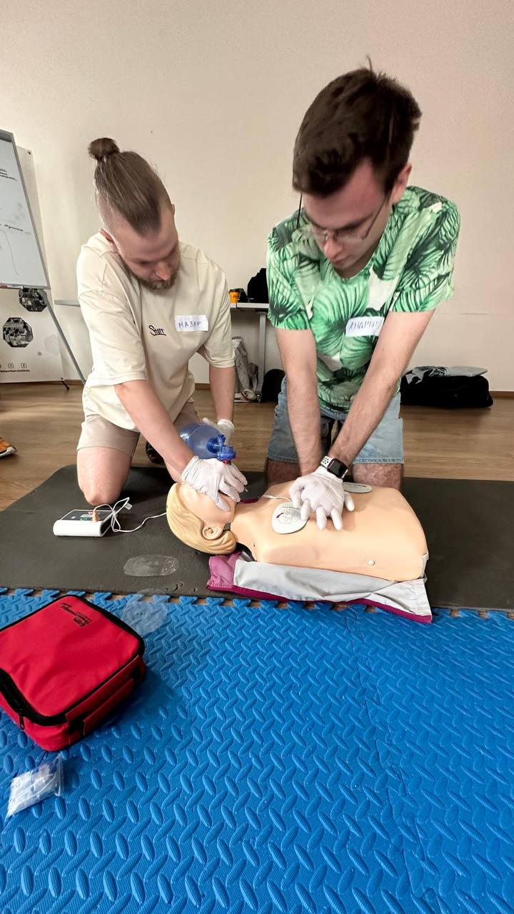
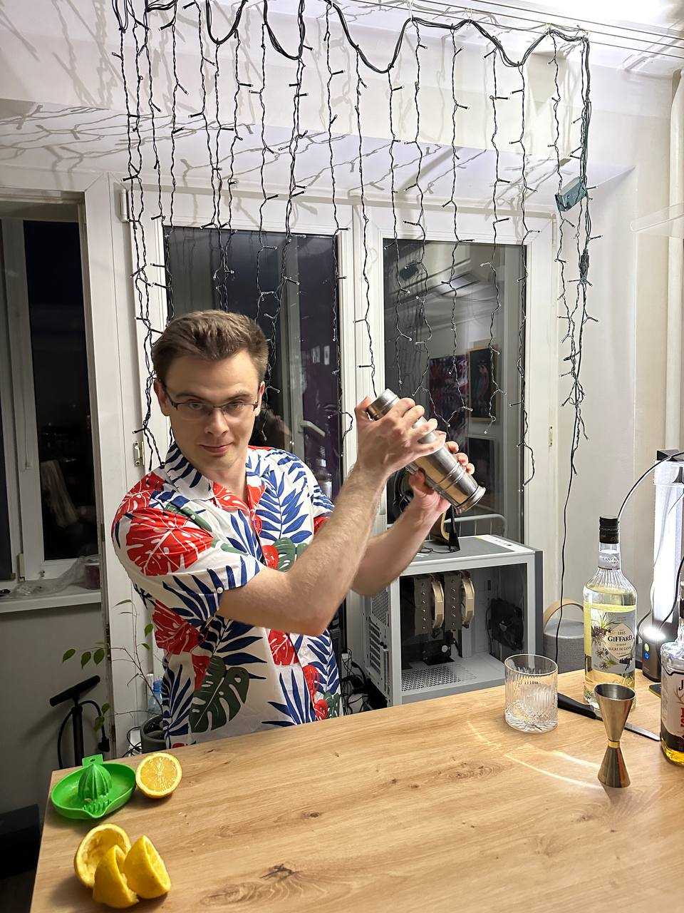
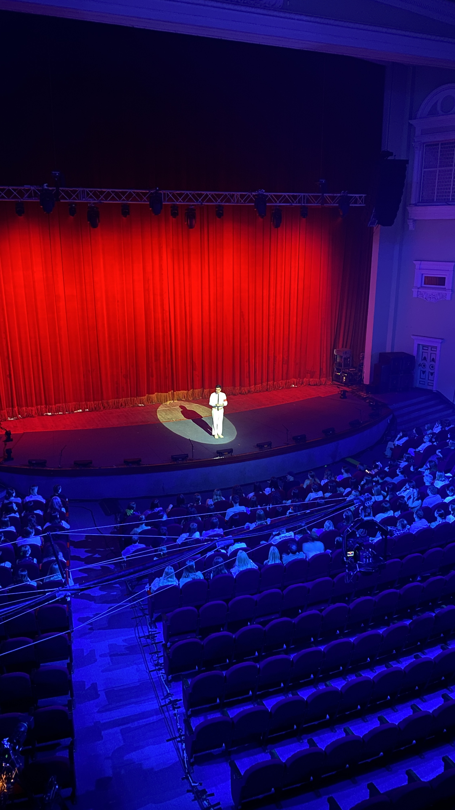
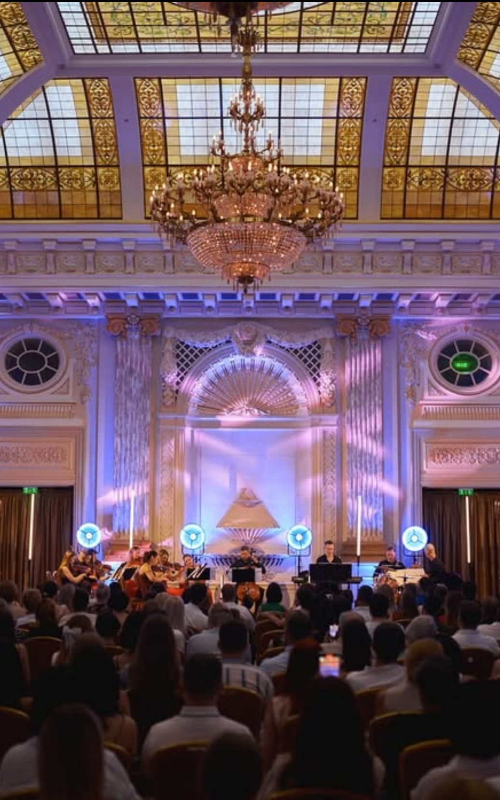
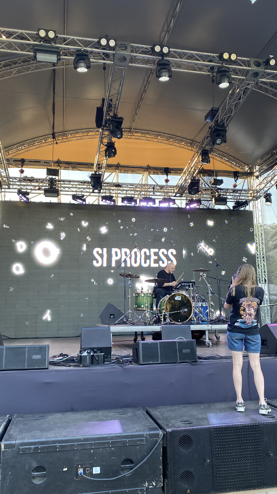
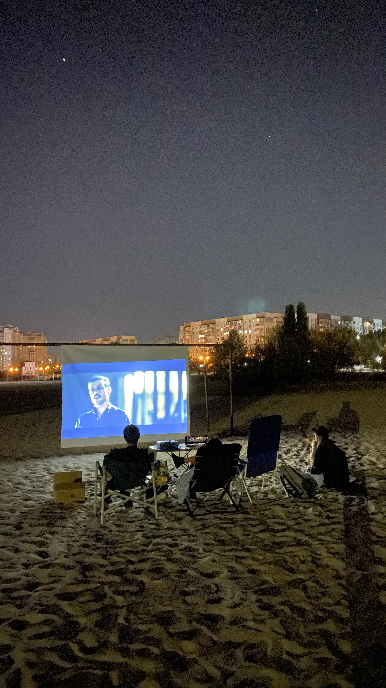
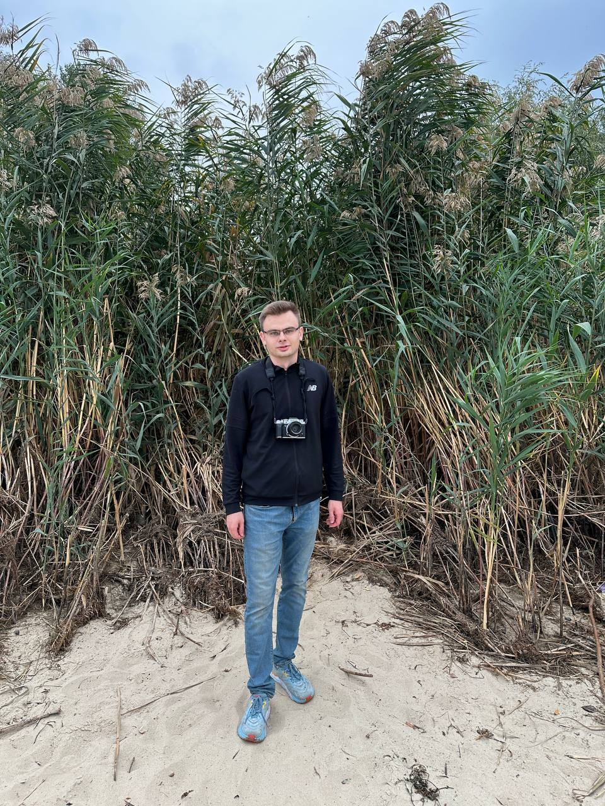
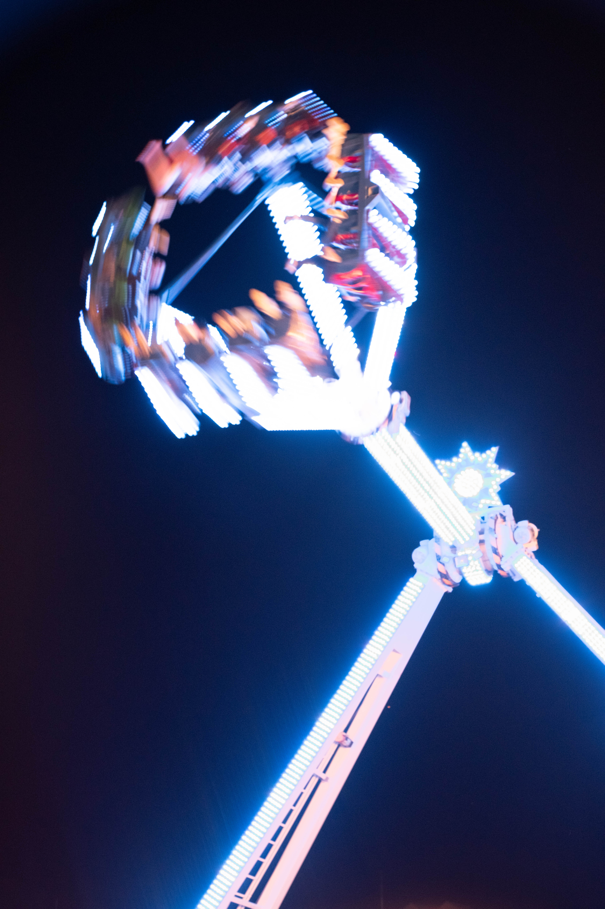

## New experience

- First aid training

- Longboard

- Making cocktail

- sup board

## Events

Most of these events happened in the capital of my country over the course of two days.

- I accidentally got to a rehearsal of [МУР](https://uk.wikipedia.org/wiki/%D0%9C%D0%A3%D0%A0_\(%D0%B3%D1%83%D1%80%D1%82\)) at [жовтневий палац](https://uk.wikipedia.org/wiki/%D0%9C%D1%96%D0%B6%D0%BD%D0%B0%D1%80%D0%BE%D0%B4%D0%BD%D0%B8%D0%B9_%D1%86%D0%B5%D0%BD%D1%82%D1%80_%D0%BA%D1%83%D0%BB%D1%8C%D1%82%D1%83%D1%80%D0%B8_%D1%96_%D0%BC%D0%B8%D1%81%D1%82%D0%B5%D1%86%D1%82%D0%B2_%D0%A4%D0%B5%D0%B4%D0%B5%D1%80%D0%B0%D1%86%D1%96%D1%97_%D0%BF%D1%80%D0%BE%D1%84%D1%81%D0%BF%D1%96%D0%BB%D0%BE%D0%BA_%D0%A3%D0%BA%D1%80%D0%B0%D1%97%D0%BD%D0%B8)  

- Vivaldi at [Marco Concert](https://www.instagram.com/marcoconcert/)

- [SI Process](https://www.instagram.com/si_process/)

 - Organized a movie on the beach

- Rave inside of museum

## Purchases

In this year i made a lot of purchases.

- Speakers: Klipsch The Fives - because it offer great sound quality, a stylish design, and the convenience of built-in amplification, making them perfect for both music and home entertainment setups.

- Camera: Fujifilm X-T4 - because it offers excellent image quality, in-body stabilization, a compact design, and a classic aesthetic that inspires creativity, making it perfect for both photography and video. I didn’t go for the Sony Alpha because it feels more like a professional tool for a job rather than something enjoyable for a hobby. The Fujifilm, with its tactile controls and retro design, feels more personal and engaging, aligning better with my passion for photography as a creative outlet rather than just a task.

- Single board computer: Raspberry Pi 5 - to experiment with DIY projects, set up a home server, and explore coding and electronics in a compact, affordable, and versatile platform.
- Vinyl turntable: Audio-Technica AT-LP120 - because it offers a sturdy build, classic design, making it perfect not for pure sound quality but for the vibe and experience of enjoying vinyl records. I wanted to collect my favorite albums on vinyl and immerse myself in the nostalgic and tactile joy of listening to music.
- Longboard to have fun with friends.
- 3D printer: Bambulab A1 (unfortunately I hardly used it)

## Projects

- Started blog posting
- [Browser Extension to create YouTube playlist by time interval](https://github.com/andriyor/youtube-timestamp-playlist-ext)
- [Visualize dependency tree of typescript based project](https://github.com/andriyor/coverage-tree-next)
- [Convert CommonJS export to ESM export](https://github.com/andriyor/cjs2mjsExport)

## Photos

## Music

[YouTube Playlist of discovered music in 2024](https://youtube.com/playlist?list=PLrTGVe9DcWuA7zVmeqgDn7YJ4ixNpqJhr&si=ecYlzGCc9KJscfcX)

## Inspiration

- [Aiden Bai (@aidenybai) / X](https://x.com/aidenybai) - autor of [React Scan](https://react-scan.com/)
- [Theo - t3.gg (@theo) / X](https://x.com/theo)
- [Matt Pocock (@mattpocockuk) / X](https://x.com/mattpocockuk?ref_src=twsrc%5Egoogle%7Ctwcamp%5Eserp%7Ctwgr%5Eauthor)

## Apps

- [Bartender 5 - Take control of your Menu bar](https://www.macbartender.com/)
- [Little Snitch — Network Monitor and Application Firewall for macOS](https://www.obdev.at/products/littlesnitch/index.html)
- [Rogue Amoeba | SoundSource: A Superior Sound Control](https://rogueamoeba.com/soundsource/)
- [pi-hole/pi-hole: A black hole for Internet advertisements](https://github.com/pi-hole/pi-hole)
- [rcmd - Switch apps instantly using the ⌘ Right Command key](https://lowtechguys.com/rcmd/)
