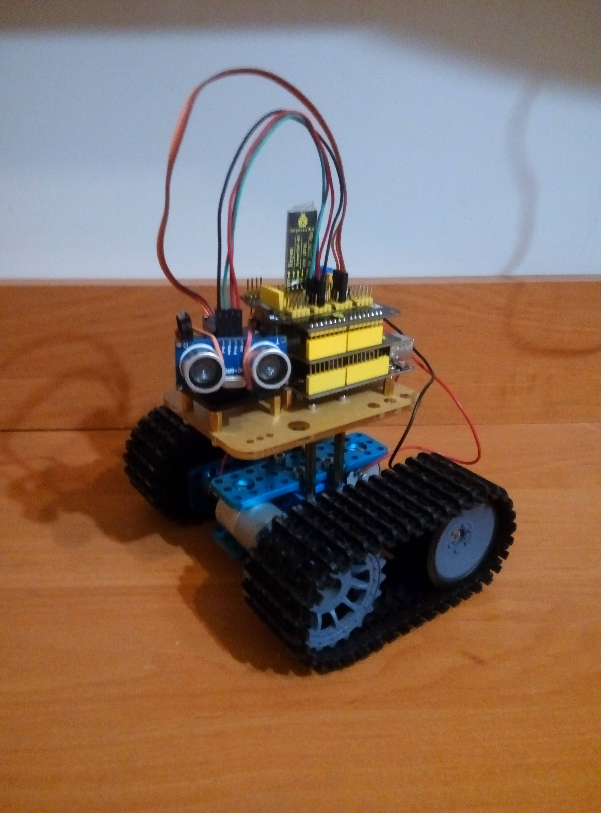

## My first introduction to a single-board computer

My first impression of the Raspberry Pi was how powerful and versatile it was for such a small and affordable device. At 2017 I was learning Python with Flask and wanted to try running a web server on the Raspberry Pi. It felt like the perfect tool for experimenting and bringing my coding projects to life, especially since it could handle real-world applications despite its tiny size. I was also deeply interested in IoT and automation, spending hours reading articles and watching YouTube videos about innovative projects. One of my biggest inspirations was the  [DIY Google Home](https://techcrunch.com/2017/05/04/this-diy-google-home-uses-raspberry-pi-and-cardboard-to-make-the-magic-happen/), which showcased how a Raspberry Pi could power a voice-controlled virtual assistant.

Unfortunately for those days, I never brought those dreams to life. Instead, I'm stuck to the path recomended by other developers of deploying my projects to cloud platforms like Google Cloud and DigitalOcean. While the cloud was practical and convenient, I couldn't shake the feeling that I had missed out on the hands-on excitement of bringing my Raspberry Pi projects to life.

## Experience with arduino

At university in 2018, I took a subject focused on robotics, though it primarily focused around theoretical concepts and modeling rather than hands-on experience. I felt a strong desire to gain more practical skills, as I wanted to move beyond simulations and work directly with hardware. This curiosity and drive led me to purchase an Arduino-based [robot](https://www.amazon.com/KEYESTUDIO-Infrared-Ultrasonic-Obstacle-Avoidance/dp/B07X4W7SZ5). It seemed like the perfect starting point to bridge the gap between theory and practice, giving me a chance to experiment, build, and truly understand how robotics works in a real-world setting.

This opportunity also allows me to gain more hands-on experience with the C programming language, which I had previously studied. It provides a chance to reinforce my understanding, refine my skills, and apply them to practical scenarios, ensuring I continue to grow as a programmer.

## Raspberry pi projects

Only in 2024 i was inspired by DHH [post](https://world.hey.com/dhh/we-have-left-the-cloud-251760fb) about the cost savings of owning hardware, and this video I decided to purchase the Raspberry Pi 5 with 8GB of RAM.

<iframe width="560" height="315" src="https://www.youtube.com/embed/Vp4glSVPT8o?si=V24E1B34ZCaav-Ph" title="YouTube video player" frameborder="0" allow="accelerometer; autoplay; clipboard-write; encrypted-media; gyroscope; picture-in-picture; web-share" referrerpolicy="strict-origin-when-cross-origin" allowfullscreen></iframe>

### Telegram notifier

My first project called [tele-track](https://github.com/andriyor/tele-track) which is  a Telegram bot that allowed me to track messages containing specific keywords in designated channels. It is built in Python and utilizes two libraries: [Telethon](https://github.com/LonamiWebs/Telethon), which enables tracking new messages from a channel, and [pyTelegramBotAPI](https://github.com/eternnoir/pyTelegramBotAPI), which allows the bot to send messages to me.

### Ad Blocking Across the Network

Thanks to Pi-hole, a network-level ad blocker that functions as a Domain Name System (DNS) sinkhole, you can enjoy ad-free browsing across your entire network. Unlike browser extensions that block ads on individual devices, Pi-hole provides protection for all connected devices, including those where traditional ad blockers aren't effective, such as smart TVs and IoT devices.
I set up Pi-hole by following the instructions in this video: 

<iframe width="560" height="315" src="https://www.youtube.com/embed/roYduABVjo8?si=FBRob0KaiyjeKFZ2" title="YouTube video player" frameborder="0" allow="accelerometer; autoplay; clipboard-write; encrypted-media; gyroscope; picture-in-picture; web-share" referrerpolicy="strict-origin-when-cross-origin" allowfullscreen></iframe>

### Hosting personal blog

Reasons why i want to write a blog:

- Share knowledge and solutions to problems i encountered
- Improve writing documentation and presentation skill
- Personal fulfillment
- Motivation to finish personal projects

I was inspired by this blogs:

- [David Heinemeier Hansson](https://world.hey.com/dhh)
- [TransitiveBullsh.it](https://transitivebullsh.it/)
- [Blog @ tonsky.me](https://tonsky.me/)
- [Вастрик](https://vas3k.blog/)
- [kettanaito.com](https://kettanaito.com/)
- [Copper - Alin Panaitiu](https://alinpanaitiu.com/blog/)
- [Anthony Fu](https://antfu.me/)

I chose [Astro](https://github.com/withastro/astro) for my blog because it’s fast, lightweight, and easy to use. It supports writing content in Markdown, making post creation simple, and its performance-focused design ensures a great user experience.

To host the static files generated by Astro I used the [serve](https://github.com/vercel/serve) package . It provided a simple and efficient way to serve the built files without needing a complex server setup.

For writing Markdown I chose [Obsidian](https://obsidian.md/) because it offers in-place editor with clean and distraction-free interface.

 To enable secure external access to my blog hosted on a Raspberry Pi I used [Cloudflare Tunnel](https://www.cloudflare.com/products/tunnel/). This setup allows me to expose the blog to the internet without directly opening ports, ensuring security.
 
<iframe width="560" height="315" src="https://www.youtube.com/embed/ey4u7OUAF3c?si=XmVDPRo10whwbHl4" title="YouTube video player" frameborder="0" allow="accelerometer; autoplay; clipboard-write; encrypted-media; gyroscope; picture-in-picture; web-share" referrerpolicy="strict-origin-when-cross-origin" allowfullscreen></iframe>

While setting up access to my blog on a Raspberry Pi, I gained new knowledge about how DNS works, including concepts like domain resolution and CNAME records.  This experience deepened my understanding of how web traffic is routed across the internet.

<iframe width="560" height="315" src="https://www.youtube.com/embed/NiQTs9DbtW4?si=LdIEaHcbpljyRGR-" title="YouTube video player" frameborder="0" allow="accelerometer; autoplay; clipboard-write; encrypted-media; gyroscope; picture-in-picture; web-share" referrerpolicy="strict-origin-when-cross-origin" allowfullscreen></iframe>

With [pm2](https://github.com/Unitech/pm2) I manage both my blog and bot, ensuring they run smoothly and restart automatically if they crash. It provides an easy way to monitor their performance and keep them consistently available with minimal effort.

I was pleasantly surprised to see that my Raspberry Pi was using only around 500 MB of memory while running my bot, Pi-hole, and blog. It’s incredible how efficiently these services manage resources, leaving plenty of headroom for other tasks.

- Blog ~ 70mb
- Bot ~ 60mb
- Pi-hole ~30mb

<blockquote class="twitter-tweet">
Paying $5/month for hosting is too much. 💩  Get an ESP32 and add needed parts for under $10.  Use a free Cloudflare Tunnel.  Enjoy self-hosting for free! 😎 <a href="https://t.co/lSNSzZA2yb">pic.twitter.com/lSNSzZA2yb</a>
&mdash; Robin Faraj (@robin_faraj) <a href="https://twitter.com/robin_faraj/status/1854221407137284583?ref_src=twsrc%5Etfw">November 6, 2024</a></blockquote> 

## Conclusion

Every developer can benefit from using a Raspberry Pi or similar device as a homelab server, serving as a versatile tool for learning and experimentation. It’s perfect for hosting a personal blog, running Pi-hole for network-level ad blocking, and testing pet projects, all while using minimal resources. Setting up these services provides hands-on experience with networking, DNS, and server management, making it an invaluable platform for gaining practical knowledge and exploring new ideas.

