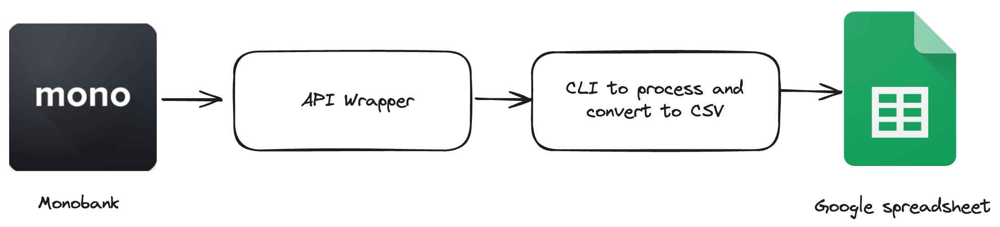

## Problem

I use [monobank](https://monobank.ua/), and overall, it's a great bank with a user-friendly app. One feature I appreciate is the statistics page, which provides a general overview of spending. However, it isn't enough for me because I need more detailed and advanced insights about my finances.

For instance, I’d like to see:

1. **Average Monthly Expenses**: A breakdown of my typical spending patterns over a few months to understand my financial habits better.
2. **Statistics by Amount Range**: Grouping expenses into categories based on amount ranges, like small daily purchases versus larger one-time expenses, to identify where my money goes.
4. **More precise categorization.**

## Solution



Thankfully, my bank provides an [API](https://api.monobank.ua/docs/index.html) that allows me to access all my transactions programmatically. By leveraging this API, I can retrieve detailed transaction data and convert it into a CSV file. Once I have the data in CSV format, I import it into an google spreadsheet, where I can analyze and organize the information to suit my needs.

Since the bank's API comes with certain limitations—such as not allowing the retrieval of all data in a single request and limit each request to a maximum of 500 transactions - I decided to create a small [wrapper](https://github.com/andriyor/monobank-api) around the API to simplify interaction.

This wrapper acts as a bridge between my CLI application and the API, handling these limitations seamlessly. For example, it automatically handles pagination by sending multiple requests as needed to retrieve all transactions by making single function call. I created this wrapper as a standalone project to keep responsibilities separate and ensure reusability.

I also integrated an MCC (Merchant Category Code) [dataset](https://github.com/Oleksios/Merchant-Category-Codes) into the project to improve the precision of transaction categorization. By mapping each transaction's MCC to its corresponding category, I was able to provide more accurate and detailed insights into spending habits.

## How to run

To use this CLI tool, you first need an API token, which can be obtained by following [link](https://api.monobank.ua/index.html). Once you have the token, set it as an `MONO_TOKEN` environment variable to enable the tool to authenticate and interact with the API.

Since this tool hasn’t been published yet, you'll need to clone the repository and run the script locally to use it.

```sh
git clone git@github.com:andriyor/monobank-airtable.git
npm -i g tsx
cd monobank-airtable
export MONO_TOKEN=****
tsx src/monobank-csv.ts --start 2024.11.23 --end 2024.11.24 --file result.csv
```

Running this command will generate a CSV file. You can then copy and [paste](https://support.google.com/docs/answer/6325535?hl=en&co=GENIE.Platform%3DDesktop) its content into the provided Google Sheets [template](https://docs.google.com/spreadsheets/d/1SCBu7zQN4fNSDcMEr-2Pxtx9kYjAMPKHSQZx0Th6DWs/edit?usp=sharing) for further analysis.  

As a future improvement, I plan to automate this task by scheduling it to run weekly, eliminating the need for manual execution.
